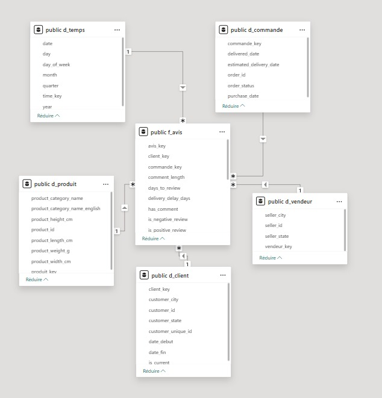
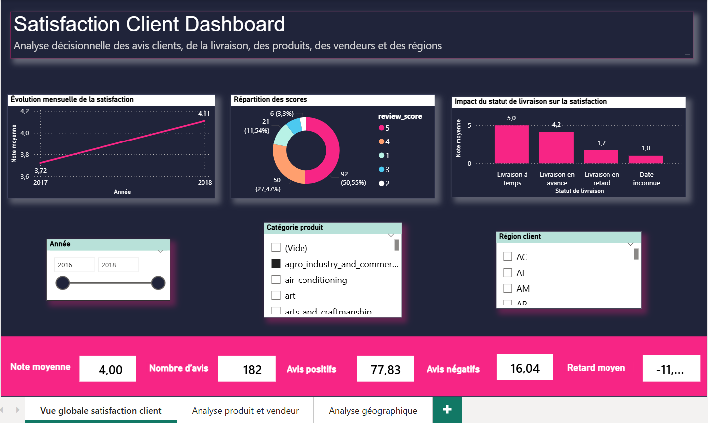
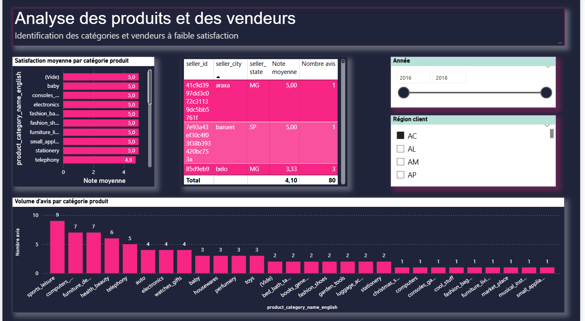
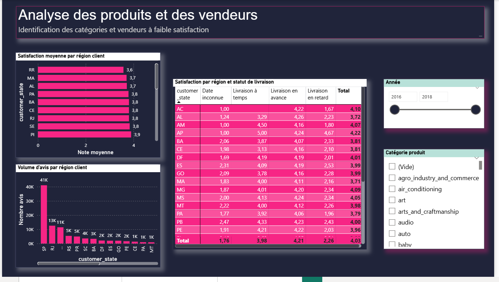

# 📊 Customer Satisfaction BI — Olist

An end-to-end **Business Intelligence project** focused on analyzing customer satisfaction in an e-commerce context using the **Olist dataset**.

The project transforms raw e-commerce data into a decision-oriented **Data Mart** using **PostgreSQL, Talend Open Studio, SQL/OLAP, and Power BI**.

---

## 🎯 Objectives

The main objective is to analyze customer satisfaction and identify factors that influence customer experience.

The project focuses on questions such as:

- What is the overall level of customer satisfaction?
- Which product categories and sellers receive the lowest ratings?
- Do delivery delays affect customer satisfaction?
- How does satisfaction vary across regions?
- How does customer satisfaction evolve over time?

---

## 🗄️ Data Mart

The project uses a **star schema** centered around the `F_AVIS` fact table.

The main dimensions are:

| Dimension | Description |
|---|---|
| `D_TEMPS` | Time analysis |
| `D_CLIENT` | Customer information |
| `D_PRODUIT` | Product and category information |
| `D_VENDEUR` | Seller information |
| `D_COMMANDE` | Order and delivery information |

### Star Schema



---

## 🔄 ETL & Data Processing

The ETL process was implemented using **Talend Open Studio 7.3.1** and **PostgreSQL**.

The process includes:

1. Extraction of the Olist source data
2. Loading into staging tables
3. Data transformation and integration
4. Loading of the Data Mart dimensions
5. Loading of the `F_AVIS` fact table
6. Data validation and analysis

The project also includes a **Slowly Changing Dimension Type 2 (SCD2)** implementation for historical data management.

---

## 📊 Power BI Dashboard

The final results are presented through an interactive **Power BI dashboard** covering global KPIs, product and seller analysis, and geographic analysis.

### Global Overview



### Product & Seller Analysis



### Geographic Analysis



The Power BI file is available in:

```text
powerbi/dashboard.pbix

---

## 🛠️ Technologies

- PostgreSQL
- Talend Open Studio 7.3.1
- SQL
- OLAP
- Power BI
- DAX
